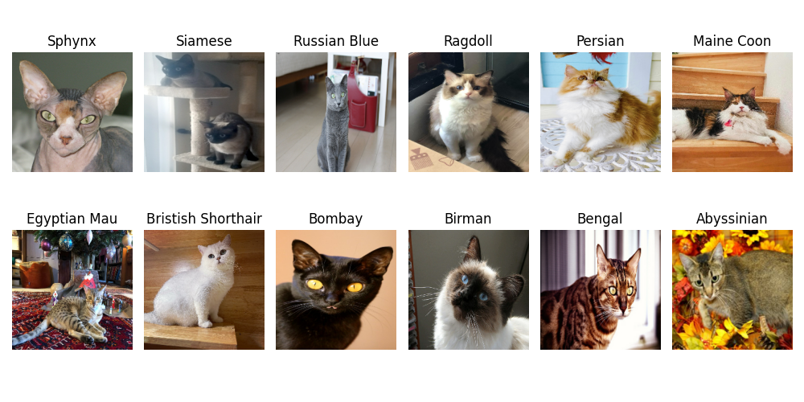
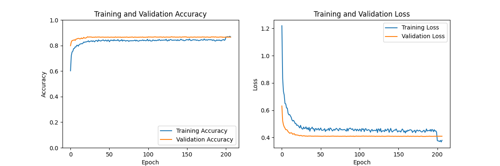
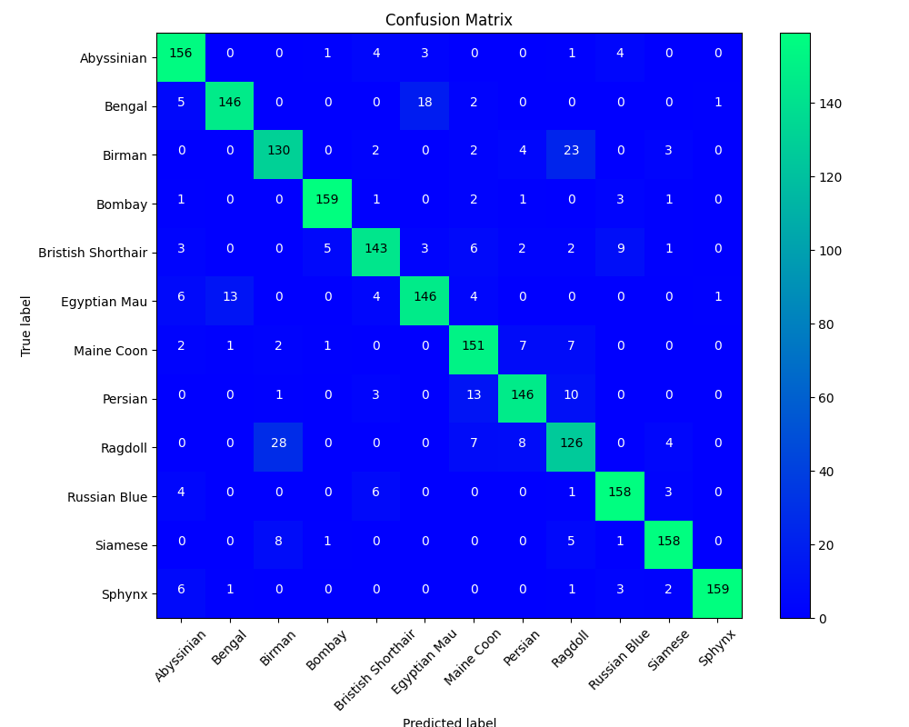

# Cat Breeds Classification Model

This project focuses on building and training a deep learning model to classify different cat breeds from images using the Oxford-IIIT Pet
Dataset. The model leverages a pre-trained MobileNetV2 architecture and fine-tunes it for our specific classification task.

## Table of Contents

- [Approach](#approach)
- [Data Preprocessing](#data-preprocessing)
- [Data Augmentation](#data-augmentation)
- [Model Architecture](#model-architecture)
- [Training](#training)
- [Evaluation](#evaluation)
- [Prediction](#prediction)
- [Usage](#usage)
- [Dependencies](#dependencies)

## Approach

1. **Data Collection**: We use the Oxford-IIIT Pet Dataset, specifically a refined version containing around 10,000 images of cats.
2. **Data Splitting**: The dataset is split into training and validation sets using an 80/20 ratio.
3. **Data Preprocessing**: Images are resized, normalized, and labels are one-hot encoded.
4. **Data Augmentation**: Augmentations are applied to the training data to improve the model's generalization.
5. **Model Development**: A pre-trained MobileNetV2 model is fine-tuned for classification.
6. **Training and Fine-tuning**: The model is initially trained and then fine-tuned with specific layers unfrozen to improve accuracy.
7. **Evaluation**: Model performance is evaluated using accuracy, classification report, and confusion matrix.
8. **Prediction**: The trained model is used to predict cat breeds from new images.

## Data Preprocessing

- **Image Paths and Labels**: We extract image paths and corresponding labels from the dataset directory.
- **Label Encoding**: Labels are encoded using `LabelEncoder` from scikit-learn and converted to categorical format.
- **Image Preprocessing**: Images are read, resized to (224, 224), and normalized to the range [0, 1].

## Data Augmentation

To improve the model's robustness and generalization, we apply the following augmentations using `tf.keras`:

- Random horizontal and vertical flips
- Random rotations up to 20 degrees
- Random brightness and contrast adjustments

## Model Architecture

The model uses a pre-trained MobileNetV2 as the base model:

- **Base Model**: MobileNetV2 with weights pre-trained on ImageNet, excluding the top classification layer.
- **Additional Layers**:
    - Rescaling layer
    - Batch normalization layers
    - Convolutional and pooling layers
    - Dropout layers for regularization
    - Fully connected layers for final classification

## Training

- **Initial Training**: The base model's layers are frozen, and only the custom top layers are trained.
- **Fine-tuning**: The top layers of the base model are unfrozen, and the entire model is fine-tuned with a lower learning rate.
- **Callbacks**: Learning rate scheduler and early stopping callbacks are used to optimize training.

## Evaluation

- **Accuracy**: The model's accuracy is tracked during training and validation.
- **Classification Report**: A detailed report of precision, recall, and F1-score for each class.
- **Confusion Matrix**: Visual representation of the model's performance in classifying each breed.

## Prediction

The trained model is used to predict cat breeds from new images. The images are preprocessed similarly to the training data, and predictions
are made using the trained model.

## Usage

1. **Load Data**: Ensure the dataset is in the correct directory structure.
2. **Train Model**: Run the script to train and fine-tune the model. The model is saved after training to the `saved_model.keras` file. If
   you want to re-train the model, delete the file.
3. **Predict**: Use the trained model to predict cat breeds from new images.

## Dependencies

- Python 3.x
- TensorFlow
- NumPy
- scikit-learn
- Matplotlib
- split-folders

```bash
pip install tensorflow numpy scikit-learn matplotlib split-folders
```

## Results
- **All Classes**:



- **Augmentation**:


- **Training Process - 200 Epochs**:



- **Classification Report**:

![Classification Report]

- **Confusion Matrix**:



- **Results & Confidence**:

![Results & Confidence]